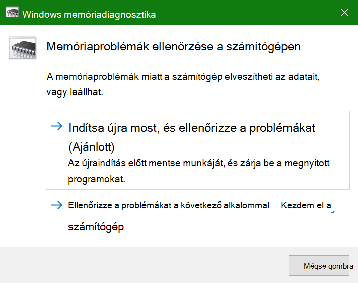

# A Windows memóriadiagnosztika futtatása a Windows 10-benRun Windows Memory Diagnostics in Windows 10

Ha a Windows és a PC-n telepített alkalmazások összeomlanak, lefagynak vagy instabilan működnek, probléma lehet a PC memóriájával (a RAM-mal).If Windows and apps on your PC are crashing, freezing, or acting in an unstable manner, you may have a problem with the PC’s memory (RAM). A Windows memóriadiagnosztika futtatásával ellenőrizheti, hogy vannak-e problémák a PC RAM-jával kapcsolatban.You can run the Windows Memory Diagnostic to check for problems with the PC’s RAM.

A tálcán lévő keresőmezőbe írja be a **memóriadiagnosztika** szót, majd válassza ki a **Windows memóriadiagnosztika** alkalmazást.In the search box on your taskbar, type **memory diagnostic**, and then select **Windows Memory Diagnostic**. 

A diagnosztika futtatásához a PC-nek újra kell indulnia.To run the diagnostic, the PC needs to restart. Lehetősége van azonnal újraindítani a PC-t (először mentse a munkáját, és zárja be a megnyitott dokumentumokat és e-maileket), vagy beütemezheti a diagnosztika automatikus futtatását a PC következő újraindulásakor:You have the option to restart immediately (please save your work and close open documents and e-mails first), or schedule the diagnostic to run automatically the next time the PC restarts:

A PC újraindítása után automatikusan futni kezd a **Windows memóriadiagnosztika eszköz**.When the PC restarts, the **Windows Memory Diagnostics Tool** will run automatically. A diagnosztika futása során megjelenik az állapot és a folyamat előrehaladása, és a billentyűzeten levő **ESC** billentyű lenyomásával megszakíthatja a diagnosztikát.Status and progress will be displayed as the diagnostics run, and you have the option of cancelling the diagnostics by hitting the **ESC** key on your keyboard.

A diagnosztika befejeződése után a Windows a szokásos módon elindul.When the diagnostics are complete, Windows will start normally.
Közvetlenül az újraindítás után, az asztal megjelenésekor megjelenik egy értesítés (a tálcán lévő **Műveletközpont** ikon mellett), amely jelzi, hogy találhatók-e memóriahibák.Immediately after restart, when the Desktop appears, a notification will appear (next to the **Action Center** icon on the taskbar), to indicate whether any memory errors were found. Például:For example:

Ez itt a Műveletközpont ikonja:Here's the Action Center icon:  

Ez pedig egy példa az értesítésre:And a sample notification: 

Ha elmulasztotta az értesítést, a tálcán lévő **Műveletközpont** ikon kiválasztásával megjelenítheti a **Műveletközpontot**, amely tartalmazza az értesítések görgethető listáját.If you missed the notification, you can select the **Action Center** icon  on the taskbar to display the **Action Center** and see a scrollable list of notifications.

A részletes információk áttekintéséhez írja be az **esemény** szót a tálcán található keresőmezőbe, majd válassza az **Eseménynapló** alkalmazást.To review detailed information, type **event** into the search box on your taskbar, and then select **Event Viewer**. Az **Eseménynapló** bal oldali ablaktáblájában lépjen a **Windows-naplók > Rendszer** elemre.In the **Event Viewer**’s left-hand pane, navigate to **Windows Logs > System**. A jobb oldali ablaktáblában fentről lefelé haladva nézze át a listát, és figyelje a **Forrás** oszlopot, amíg nem talál olyan eseményeket, amelyeknél a Forrás értéke **MemoryDiagnostics-Results**.In the right-hand pane, scan down the list while looking at the **Source** column, until you see events with Source value **MemoryDiagnostics-Results**. Jelölje ki sorban mindegyik ilyen eseményt, és a lista alatti **Általános** lapon levő mezőben tekintse meg az eredményeket.Highlight each such event and see the result information in the box under the **General** tab below the list.
